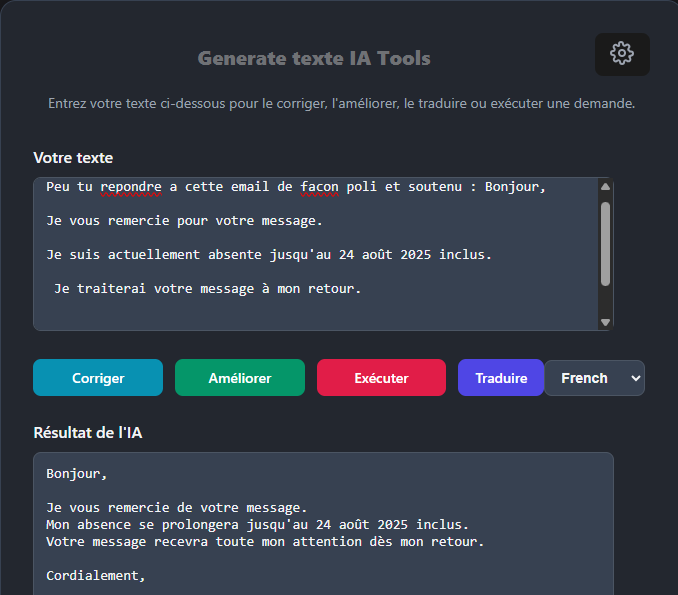
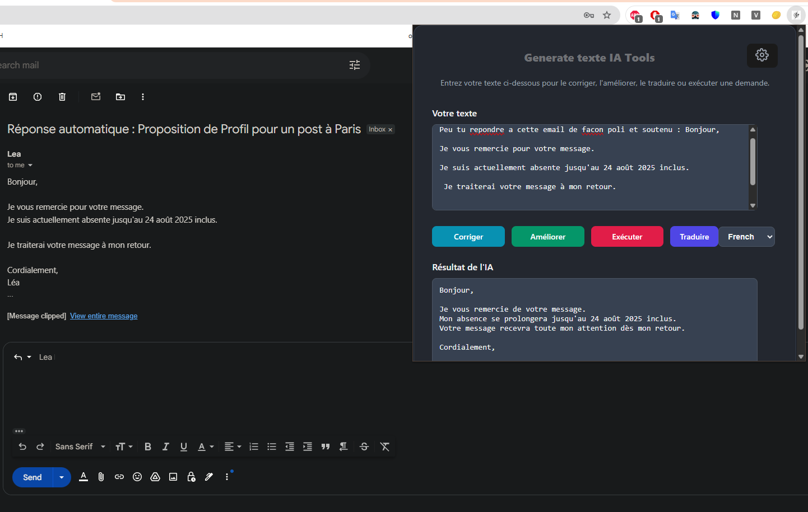

# Extension Text Tools AI

Extension Text Tools AI is a Chrome extension designed to help users write, correct, and translate text using powerful AI API calls.



## Why This Extension Was Developed

This extension was created to save you time and streamline your workflow. Instead of opening multiple windows or tabs just to interact with your AI assistant, you can access powerful AI tools directly within your browser—making writing, correcting, and translating text faster and more convenient.

## Features

- **AI Writing Assistance**: Generate and improve text with AI suggestions.
- **Grammar & Spell Correction**: Instantly correct grammar and spelling mistakes.
- **Translation**: Translate text between multiple languages using AI.
- **Easy to Use**: Simple interface integrated directly into your browser.

## Installation

1. Clone or download this repository.
2. In the project directory, run `npm install` to install dependencies.
3. For development, run `npm run dev` to start the development build.
4. For production, run `npm run build` to generate the release files.
5. Open Chrome and go to `chrome://extensions/`.
6. Enable "Developer mode".
7. Click "Load unpacked" and select the `dist` directory generated by the build process.

## Usage

- Highlight any text or open the extension popup.
- Write your text.
- Choose to correct, enhance, execute, or translate your text.
  - **Correct**: Fix grammar and spelling errors.
  - **Enhance**: Improve clarity, style, or tone.
  - **Execute**: Perform a specific task described in your text (e.g., write a cover letter, create an email).
  - **Translate**: Convert your text to another language.
- The extension will use an AI API to process your request and display the result.



## Configuration

### Set Model AI :

- Set Gemini API:

Add URL Gemini :

```
https://generativelanguage.googleapis.com/v1beta/models/gemini-2.5-flash-preview-05-20:generateContent?key=
```

Add API KEY:

1. Go to `https://aistudio.google.com/apikey`
2. Build a API key
3. Add the key in the configuration

### Set Local AI Model :

- Set your Local LMSTUDIO:

URL:

```
http://localhost:1234/api/v0/chat/completions
```

Model AI :
it will alone fond which service SLM or LLM is up in local

```
granite-3.0-2b-instruct
```

## License

MIT License

---

_This project is not affiliated with Google Chrome or any AI API provider._
